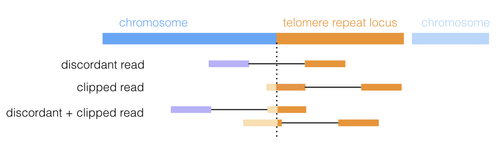
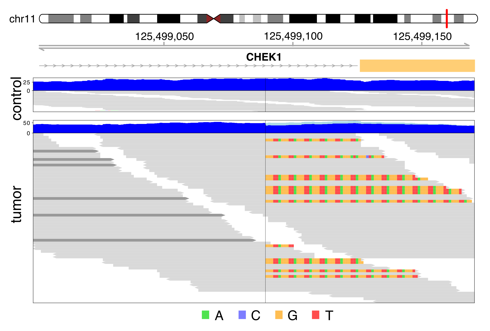
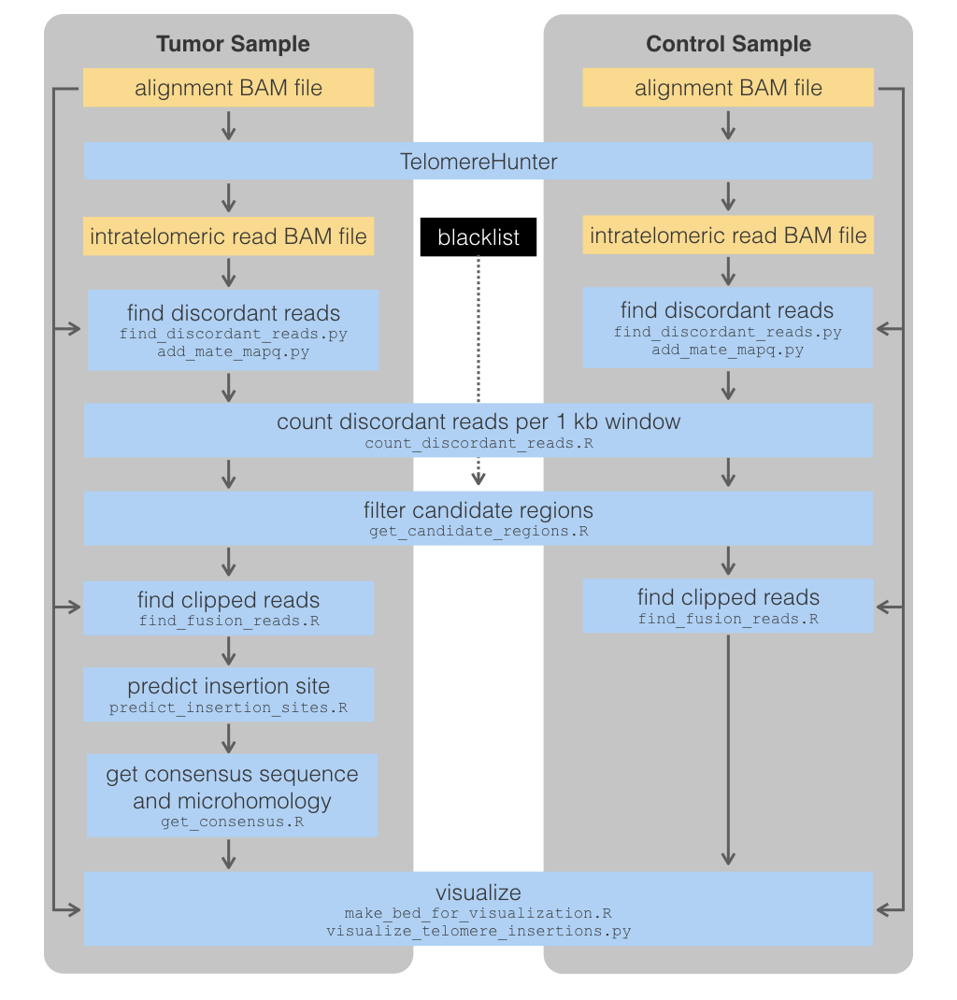
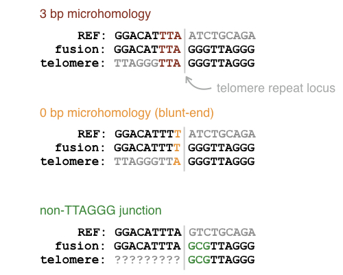

# TelomereRepeatLoci
*Snakemake workflow for detection of telomere repeat loci from WGS data*

This [Snakemake](https://snakemake.readthedocs.io/en/stable/) workflow detects telomere repeat loci within cancer genomes from WGS data. The input are BAM files from a tumor and a control sample (if available). In the first step, telomeric reads are extracted using the tool [TelomereHunter](https://bmcbioinformatics.biomedcentral.com/articles/10.1186/s12859-019-2851-0). From the extracted telomeric reads, discordant reads are retrieved, where one mate is intratelomeric and the other mate is mapped to the chromosome. In regions with discordant reads, it then searches for clipped reads to find the precise position of the inserted telomere sequence.

  

  

If you are using the workflow, please cite:

> **TelomereHunter – in silico estimation of telomere content and composition from cancer genomes**  
Lars Feuerbach, Lina Sieverling, Katharina I. Deeg, Philip Ginsbach, Barbara Hutter, Ivo Buchhalter, Paul A. Northcott, Sadaf S. Mughal, Priya Chudasama, Hanno Glimm, Claudia Scholl, Peter Lichter, Stefan Fröhling, Stefan M. Pfister, David T. W. Jones, Karsten Rippe & Benedikt Brors  
*BMC Bioinformaticsvolume 20, Article number: 272 (2019)*

> **Alternative lengthening of telomeres in childhood neuroblastoma from genome to proteome**  
Sabine A. Hartlieb, Lina Sieverling, Michal Nadler-Holly, Matthias Ziehm, Umut H. Toprak, Carl Herrmann, Naveed Ishaque, Konstantin Okonechnikov, Moritz Gartlgruber, Young-Gyu Park, Elisa Maria Wecht, Kai-Oliver Henrich, Larissa Savelyeva, Carolina Rosswog, Matthias Fischer, Barbara Hero, David T.W. Jones, Elke Pfaff, Olaf Witt, Stefan M. Pfister, Katharina Kiesel, Karsten Rippe, Sabine Taschner-Mandl, Peter Ambros , Benedikt Brors , Matthias Selbach, Lars Feuerbach, Frank Westermann  
*under revision*

The workflow was also used in the following publication (where telomere repeat loci were termed "telomere insertions"):

> **Genomic footprints of activated telomere maintenance mechanisms in cancer**  
Lina Sieverling, Chen Hong, Sandra D. Koser, Philip Ginsbach, Kortine Kleinheinz, Barbara Hutter, Delia M. Braun, Isidro Cortés-Ciriano, Ruibin Xi, Rolf Kabbe, Peter J. Park, Roland Eils, Matthias Schlesner, PCAWG-Structural Variation Working Group, Benedikt Brors, Karsten Rippe, David T. W. Jones, Lars Feuerbach & PCAWG Consortium  
*Nature Communications volume 11, Article number: 733 (2020)*

---

### Detailed description of individual steps in the workflow

  

#### 1. Run TelomereHunter

  Information on TelomereHunter can be found in the [publication](https://bmcbioinformatics.biomedcentral.com/articles/10.1186/s12859-019-2851-0).
  

#### 2. Find candidate regions with discordant reads

The python script `find_discordant_reads.py` goes through the intratelomeric read BAM file produced by TelomereHunter with the module [pysam](https://pysam.readthedocs.io/en/latest/), which is a wrapper for [SAMtools](http://www.htslib.org). Reads that fulfill the following criteria are considered discordant intratelomeric reads: 1) mate is mapped and its reference ID is known, 2) mate is not an intratelomeric read. For each discordant intratelomeric read, the read name as well as the chromosome and position of the mate is extracted from the QNAME, RNEXT and PNEXT fields of the SAM format, respectively. The results are saved in a table. In the script `add_mate_mapq.py`, the strand and the mapping quality of the primary alignment of each chromosomal mate from the discordant read table are retrieved from the alignment BAM file and added to the table. Reads mapping to decoy sequences are removed. Until this point, the scripts are run individually for the tumor and the control sample. `count_discordant_reads.R` summarizes the number of discordant reads in the tumor and control sample. For this, the genome is split into strand-specific, 1 kb windows. For each window, the number of discordant reads with a mapping quality of over 30 is counted. If a blacklist of false positive regions is provided, windows contained in the blacklist are marked. Sometimes the discor- dant reads of a telomere insertion overlap the start or end of a window. To account for these cases, adjacent 1 kb windows that contain discordant reads in the tumor sample are merged. The script `get_candidate_regions.R` filters the list of windows to get candidate regions of somatic telomere insertions. Candidate regions must contain a minimum number of discordant reads in the tumor sample (set to 3 and 4 for the PCAWG and neuroblastoma analysis, respectively) and a maximum number of discordant reads in the control sample (usually 0). If specified by the user, windows contained in the blacklist are removed. This step is especially important to rule out false positives if no control sample is available.

#### 3. Find precise insertion sites with clipped reads

For each candidate region obtained in the previous step, clipped reads that span the telomere insertion junction site are searched for with `find_fusion_reads.R`. First, the script searches for soft-clipped sequences. For this, all reads in the candidate region +/- 300 bp are extracted, including the read name, sequence, position, cigar and flag. The reads are then filtered and only those containing an "S" in the cigar string are kept. Moreover, the end position of the clipped sequence is extracted. Next, hard-clipped reads are obtained by searching for supplementary alignments in the candidate region +/- 300 bp. If the candidate region is on the (+) strand, supplementary alignments are extracted with `samtools view -f 2048 -F 16`, i.e. reads that are supplementary alignments and not on the reverse strand. For those on the (-) strand, the command "samtools view -f 2064" was used, i.e. reads that are supplementary alignments and on the reverse strand. In contrast to soft-clipped reads, the SAM format does not contain the clipped sequence of supplementary alignments in the SEQ field. Therefore, the full sequence must be retrieved from the primary alignment of the read. For this, the position and strand of the primary alignment is obtained from the SA tag of the supplementary alignment. `samtools view` is used on the alignment BAM file to extract reads in the region of the primary alignment, which are further filtered by read name and strand to obtain the read sequence of the primary alignment. If supplementary and primary alignments are on opposite strands, the sequence is reverse complemented. All information on soft- and hard-clipped sequences is then merged into one table. By taking the length of the clipped sequences into account, the clipped parts of the read sequences are obtained. For each read, the number of TTAGGG and CCCTAA repeats in the clipped sequence are counted. The position of the clipped sequence, i.e. whether sequences were clipped in the upstream or downstream end of the read alignment, is inferred from the cigars.
The exact position of the telomere insertion is obtained from the position of the clipped reads by `predict_insertion_sites.R`. For this, only reads that contain at least one telomeric repeat in the clipped sequence are taken into account. If the discordant reads map to the (+) strand, the clipped parts of the reads need to be at the end of the aligned read. If the discordant reads map to the (-) strand, clipping needs to occur at the start of the reads. Moreover, the clipping position needs to be downstream or upstream of the median discordant read positions, respectively. Finally, a frequency table of the number of clipped reads ending or starting at different positions, respectively, is calculated. Here, only clipped reads with unique cigars at each position are counted. This filter was included because mapping artifacts were observed where all clipped reads mapped to exactly the same position. For each candidate region, the total number of clipped reads supporting the insertion site, the orientation of the telomere sequence (TTAGGG or CCCTAA on the forward strand) and the total number of TTAGGG and CCCTAA counts in the fusion reads is reported.

#### 4. Construct telomeric sequences at the telomere insertion sites
From the clipped sequences at the telomere insertion sites, the telomere sequences flanking each insertion site are reconstructed with `get_consensus.R`. For each position in the clipped sequences, the frequency of each base is calculated. If a base has a frequency of at least 0.65, this base is used for the consensus sequence. Otherwise, it is set to "N".
Assuming that the telomere sequence at the insertion site consists exclusively of t-type repeats, microhomology between the reference genome and the telomere sequence can be determined. For this, the reference genome sequence 20 bp upstream of the telomere insertion site is extracted. The t-type telomere repeat of the inserted telomere sequence that is closest to the insertion site is extended and each base pair is compared to that of the reference genome. Every match is counted as a base pair of sequence homology between the reference genome and the telomere sequence. As soon as a base pair does not match, the microhomology is disrupted and further homology is not considered. If the bases upstream of the first t-type repeat in the inserted telomere sequence do not match an incomplete t-type repeat, the microhomology cannot be determined and is set to "?". The information on the telomere consensus sequence and the base pairs of microhomology is added to the telomere insertion table.

  

#### 5. Make IGV-like plot
To rule out remaining false positives, each telomere insertion should be checked manually. To facilitate this process, Integrative Genomics Viewer (IGV)-like plots of each telomere insertion position are made. The script `make_bed_for_visualization.R` makes tables in BED format that contain the reference genome start and end positions used for the plots, which are 100 bp up- and downstream of the telomere insertion site. This table is then used as input for the script visualize_telomere_insertions.py. The script was adapted from [here](https://github.com/DKFZ-ODCF/IndelCallingWorkflow/blob/master/resources/analysisTools/indelCallingWorkflow/visualize.py). Given the alignment BAM files of the tumor and control sample, the script generates a PDF file for each genomic region in the input BED file, in which the reads surrounding the telomere insertions are displayed in the tumor and in the control sample. Moreover, panels with the coverage in the region are plotted. Several new features were added to the original script: the discordant reads obtained in previous steps of the telomere insertion pipeline are highlighted, hard- clipped bases are obtained from the primary alignments and displayed, non-telomeric clipped bases are transparent, while telomeric clipped bases remain opaque. With the resulting images, tumor and control sample can easily be compared and artifact-prone regions, e.g. with a lot of clipped reads, can be identified.
